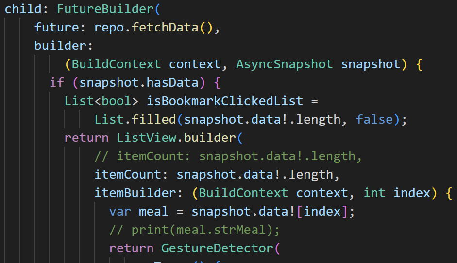
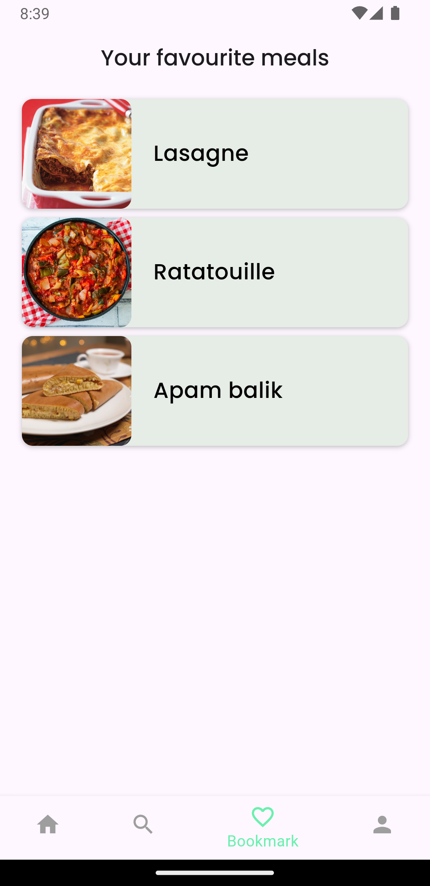
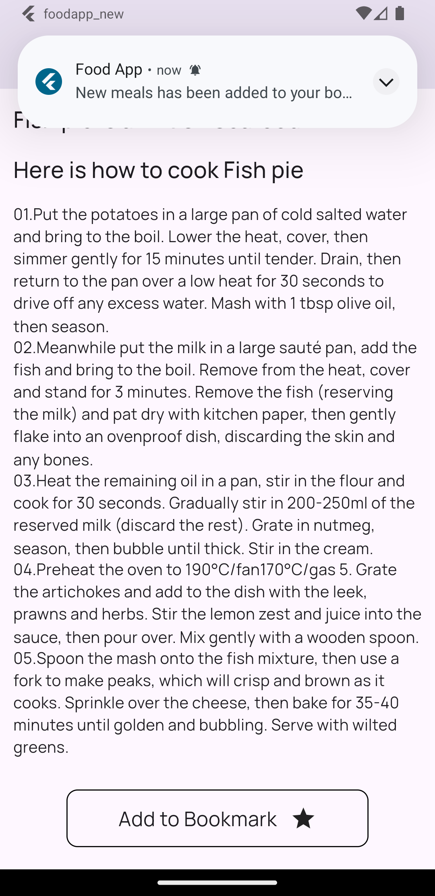
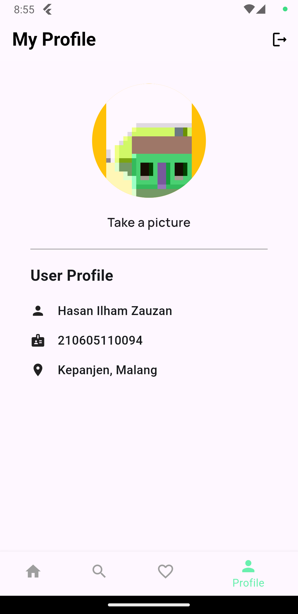

# foodapp_new

# 1. Asynchronus Porgramming
Pada aplikasi ini, pemrograman asynchronus digunakan ketika data dari api dipanggil ke tampilan 
 
Data yang dipanggil tidak langsung tampil pada halaman, tetapi data akan berjalan dibalik layar  

# 2. Shared Preferences
Pada aplikasi ini, shared preference digunakan untuk menymipan nilai boolean yang akan digunakan untuk key pada tema aplikasi yang digunakan. Ketika user memilih tema gelap, maka aplikasi akan menampilkan tema gelap. Tema tersebut akan disimpan pada boolean yang disimpan pada shared preferences. Jadi ketika aplikasi ditutup kemudian dibuka kembali, tema yang akan tampil adalah tema gelap.
Berikut adalah tampilan dari tema gelap dan terang.  

 

# 3. SQF Lite
Pada aplikasi ini, SQF LIte digunakan untuk menyimpan makanan favorit yang diambiln dari API. Ketika user memilih makanan yang disukai atau di favoritkan, aplikasi akan menyimpan makanan tersebut pada database lokal menggunakan SQF Lite. User kemudian bisa melihat makanan yang di favoritkan pada halaman bookmark.
 
Berikut adalah halaman bookmark makanan. 
 

# 4. Local Notification
Pada aplikasi ini, terdapat sebuah notifikasi yang akan ditampilkan ketika pengguna menyimpan resep dari makanan yang dipilih.  
 

# 5. Akses Kamera
Aplikasi ini juga dapat mengakses kamera dari user. Pada halaman profil, user dapat mengubah foto profil mereka dengan mengakses kamera.  

 

# Paket yang digunakan

cupertino_icons: ^1.0.6 
http: ^1.2.1 
google_fonts: ^6.2.1 
flutter_feather_icons: ^2.0.0+1 
sqflite: ^2.3.3 
shared_preferences: ^2.2.3 
path: ^1.9.0 
firebase_core: ^3.1.0 
firebase_auth: ^5.1.0 
cool_alert: ^2.0.1 
provider: ^6.1.2 
image_picker: ^0.8.6 
flutter_local_notifications: ^17.1.2 
rxdart: ^0.28.0 

API yang digunakan 
https://www.themealdb.com/api.php 

